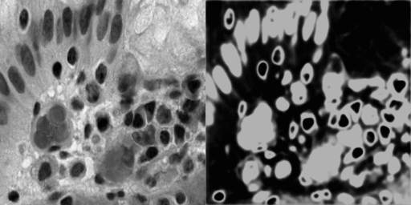

# U-Net Implementation
The following is the implementation for the U-Net: Convolutional Networks for Biomedical Image Segmentation [LINK](https://arxiv.org/abs/1505.04597)

  - The U-Net Architecture is taken from the Paper
  - Using input layer as (256,256,1) instead of (572,572,1)
  - Using [Super data bowl 2018](https://www.kaggle.com/c/data-science-bowl-2018) as the dataset

# Notes

  - I am resizing the dataset images to (256,256,1) to fit the model
  - The original paper uses image augmenation to increase sample size
* To use image augmenation 
```sh
model.fit(data_train_,data_labels_,epochs=30,callbacks=[check_points,tens_board],batch_size=16)
# model.fit_generator(final_gen,epochs=30,callbacks=[check_points,tens_board])
```
* comment out > model.fit
* uncomment  > model.fit_generator

To use the model Directly without training :
>```sh
> model=tf.keras.models.load_model('masking_model.h5')
> ```


* the image on the left is the test image of the sample
* the image on right is the mask generated by the model
